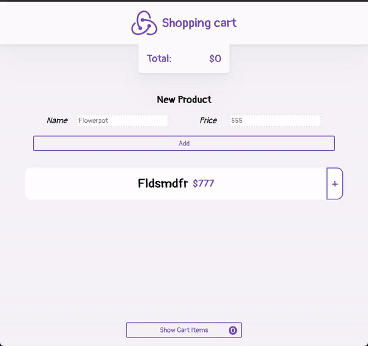

<h1 align="center">Redux Shopping Cart 🛒</h1>

  

A simple shopping cart application built with Redux.

## What I Learned

- Creating reducers to manage state for products and the cart.
- Dispatching actions to update the state.
- Subscribing to the store changes and rendering the updated state
- Handling user interactions and updating the store accordingly.

## Technologies Used

- HTML
- CSS
- JavaScript
- Redux

## Usage

- You can try out the Shopping Cart with [this demo](https://www.flaviotacca.live/redux-shopping-cart/)
